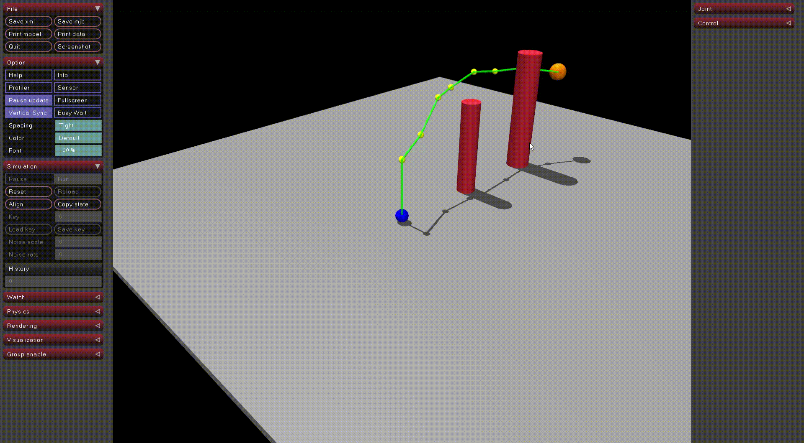
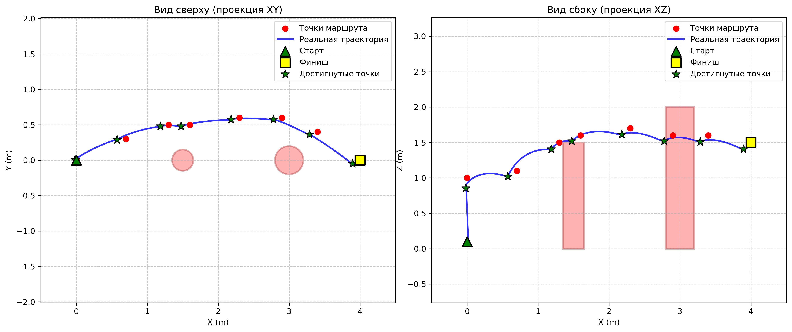

# Drone RL Navigation

Обучение с подкреплением для управления квадрокоптером в симуляционной среде MuJoCo.

---

## Описание

Проект реализует систему автономной навигации квадрокоптера с использованием обучения с подкреплением. Агент обучается управлять дроном для достижения случайных целей в трёхмерном пространстве с препятствиями. Обученная политика позволяет дрону плавно и точно двигаться к цели, облетая препятствия.

---

## Установка

```bash
git clone https://github.com/your-username/drone-rl-navigation.git
cd drone-rl-navigation
```

---

## Структура проекта

```
drone-rl-navigation/src
├── drone_env.py              # Среда обучения на базе Gymnasium и MuJoCo
├── train_rl.py               # Скрипт запуска обучения PPO
├── fly_waypoints.py          # Полёт по заданным точкам
├── scene.xml                 # MuJoCo сцена с моделью дрона
├── ppo_drone.zip             # ОБученная политика
```

---

## Обучение

```bash
python train_rl.py
```

Параметры обучения:
- Алгоритм: PPO
- Шагов: 1 000 000
- Архитектура: 2 скрытых слоя по 64 нейрона

После завершения модель сохраняется как `ppo_drone.zip`.

---

## Полёт по точкам

```bash
python fly_waypoints.py
```

Дрон последовательно проходит через все точки маршрута, используя обученную политику.

---


## Среда

### Пространство наблюдений (7 значений)

```
obs = [dx, dy, dz, vx, vy, vz, dist]
```

- `dx, dy, dz` — вектор от дрона к цели
- `vx, vy, vz` — текущая скорость дрона
- `dist` — расстояние до цели

### Пространство действий (3 значения)

```
action = [Fx, Fy, Fz]
```

- `Fx, Fy` — управляющие силы в горизонтальной плоскости
- `Fz` — вертикальная сила с компенсацией重力

Преобразование в управляющие сигналы:

```
Fx = ax * F_max_xy
Fy = ay * F_max_xy
Fz = M * g + az * F_max_z
```

где `F_max_xy = 0.8 Н`, `F_max_z = 0.4 Н`, `M = 0.1115 кг`

### Функция награды

```
R = 10.0 * progress + 200.0 * success - 0.005 * speed - 0.001 * action² - 0.03 * |vz| - 0.3 * deviation
```

- `+10` за приближение к цели
- `+200` за достижение цели (dist < 0.15 м)
- Штраф за высокую скорость
- Штраф за резкие движения
- Штраф за вертикальные перемещения
- Штраф за отклонение от прямой

### Условия завершения эпизода

- Таймаут (300 шагов)
- Падение (z < 0.1 м)
- Превышение высоты (z > 4.0 м)
- Вылет за границы (|x| > 5.0 м или |y| > 5.0 м)

---

## Результаты

---
Полёт в симуляции
---


---
Графики траектории
---

